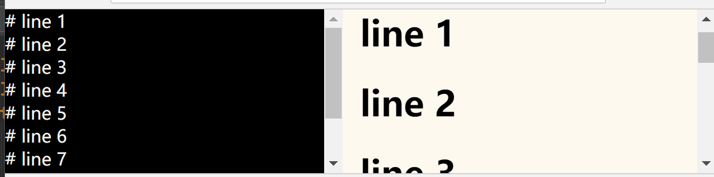

# MDEditor
Markdown Editor, developed with pure HTML5. Support real time preview and code hightlighting. This repo is inspired by 
[marked](https://github.com/markedjs/marked), and is actually use it to render the markdown codes to html.

The reason for developing this repo is that I find it painful when rendering the md code to html elements with `marked` while **keeping their coresponding 
relationship**, i.e. which markdown code block is rendered into which html element. This repo is built upon `marked` and provides a ready-to-use
editor which is able to show real time preview. [hightlight.js](https://github.com/isagalaev/highlight.js) is also put into use for code rendering.

## Warning
MDEditor now only supports limited syntax:

-  `Heading` should only starts with several hash symbols `#`
-  `table` should be wrapped with `|` in every line
-  `code block` should be wrapped with ` ``` `
-  `horizontal splitter` should use 3 or more `-`
-  `list` **there should be 2 `space`s between `.` and content, eg. `1.[space][space]something`

> It is a bug that list syntax requires 2 spaces, I will fix it as soon as I find out what the hell is going wrong.

## Advantage
1.  MDEditor can easily align the markdown code block and its corresponding html representation, 
by double click the line of code or representing html element (default)
2.  Use capital space 
(just press `space` key after pressing `Caps` key)
to simulate pressing `Tab` key. helpful when writing codes.

More under go...

## Dependencies

| dependency | version |
| :---: | :---: |
| jquery | 3.2.1 |
| marked | 0.3.4 |
| highlight.js | 9.12.0 |

## Demo
### 1. double click to do alignment


## Usage
### 1. Refer to dependencies
`style.css` is customized style for html
`tomorrow-night-eighties.css` is one of the themes for `hightlight.js`
``` html
<link rel="stylesheet" href="style.css">
<link rel="stylesheet" href="lib/highlightjs/styles/tomorrow-night-eighties.css">
<script src="lib/jquery/dist/jquery.js"></script>
<script src="lib/marked/marked.min.js"></script>
<script src="lib/highlightjs/highlight.pack.js"></script>
```

### 2. Define your editor and previewer elements
You can use any `id` for your element, just pass them to `Editor` and `Previewer` when initialising.

> ** Please ensure to set `contenteditable='true'` for your editor element**

``` html
<body>
<div id="container">
    <div id="editor" contenteditable="true">
    </div>
    <div id="previewer">
    </div>
</div>

<script src="MDEditor.js"></script>
<script>
    let editor = new Editor('editor');
    let previewer = new Previewer('previewer');
    editor.setPreviewer(previewer);
</script>
</body>
</html>
```
